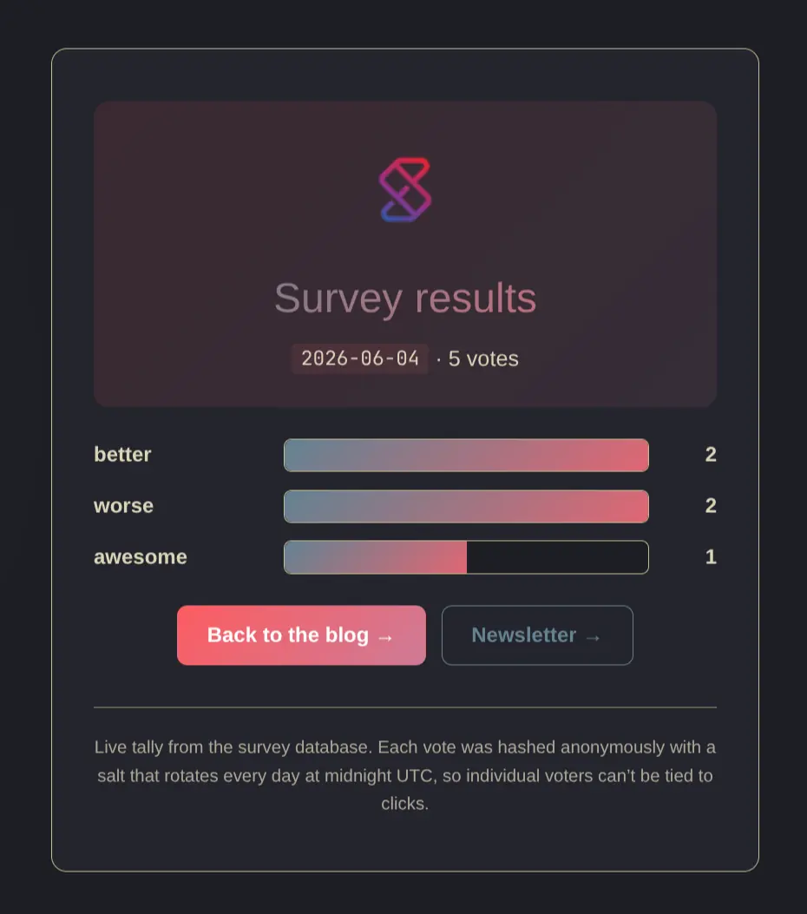

# minimal-newsletter-survey

A ~200-line Go service that records anonymous reader ratings from newsletter
links into a [DuckDB](https://ssp.sh/brain/duckdb) file. Per-newsletter, per-answer, no cookies, no JS.
Query the results from your laptop over Quack.

Design doc: [`docs/superpowers/specs/2026-06-04-newsletter-survey-design.md`](docs/superpowers/specs/2026-06-04-newsletter-survey-design.md).

## What it looks like in a newsletter

```markdown
What did you think of today's newsletter?

[Awesome!](https://q.ssp.sh/2026-06-04/awesome)
[Pretty Good](https://q.ssp.sh/2026-06-04/good)
[Could be better](https://q.ssp.sh/2026-06-04/better)
[Worse](https://q.ssp.sh/2026-06-04/worse)

See the live tally → https://q.ssp.sh/result/2026-06-04
```

The path shape is `https://<host>/<survey_id>/<answer>`:

- `<survey_id>` identifies the newsletter issue (e.g. an ISO date like
  `2026-06-04`, or a slug like `weekly-42`).
- `<answer>` is whichever rating you want to record for that click
  (`awesome`, `good`, `better`, `worse`, `meh`, …).

Both slugs are free-form, validated against `^[a-z0-9][a-z0-9_-]{0,63}$`,
so the next newsletter can use entirely different `survey_id` and `answer`
slugs without any code or schema change. Each click records one vote and
redirects to a "Thanks!" page.

The legacy URL shape `https://<host>/survey/<survey_id>/<answer>` is kept
working so links shipped in past newsletters don't 404 — new newsletters
should use the shorter `/<survey_id>/<answer>` form.

### Per-survey results page

`https://<host>/result/<survey_id>` renders a small HTML page with a CSS
bar chart of the tally — same design as the `/thanks` page. The Go
handler reads from DuckDB and renders the bars server-side, so there's no
DuckDB-WASM and no query interface exposed to the browser. Whoever knows
the `survey_id` slug can view its results; nobody else can poke at the
DB. Marked `noindex` so it doesn't end up in search engines.


See [q.ssp.sh/result/init/](https://survey.ssp.sh/result/2026-06-04) as an example:



## How votes are deduplicated

`voter = sha256(ip || ua || daily_salt || survey_id)[:16]` (hex).

- The daily salt is 32 random bytes generated in memory at startup, rotated
  every midnight UTC, and regenerated on every process restart. It is
  **never written to disk**.
- After rotation, yesterday's hashes can no longer be reproduced from logs.
- Including `survey_id` in the hash means the same reader produces different
  hashes for different newsletters, so cross-issue tracking is impossible.

If the same reader clicks twice on the same newsletter (e.g. Awesome, then
Good), the second click replaces the first — last vote wins.

## One-time server setup

The server needs Go, a `libduckdb` available to the linker (or a built-in
one via the Go bindings on Linux), an env file with a generated Quack
token, and a service supervisor. Pick your platform:

- **[Railway](docs/install-railway.md)** — Docker-based, one service,
  persistent volume for the DuckDB file. HTTP on Railway's HTTPS edge,
  Quack exposed via TCP Proxy so you can `ATTACH` from your laptop without
  custom DNS up front.
- **[Linux (EC2 / Hetzner / anywhere)](docs/install-linux.md)** — much
  shorter. `duckdb-go-bindings/v2` ships a prebuilt `libduckdb` for Linux,
  so `go build` Just Works. ~10 lines of shell + a systemd unit.
- **[FreeBSD](docs/install-freebsd.md)** — what I actually run on `ti`.
  Needs a from-source DuckDB build (~20 min) because upstream ships no
  FreeBSD binaries. Automated via `make push-installer` → `make install-on-server`.

> [!NOTE]
> FreeBSD because I already have one running on my self-hosted server, so it
> costs me nothing extra. If I were starting fresh, EC2 with the Linux guide
> would be ~$3-7/mo and would skip the source build entirely.

## Reverse proxy + TLS (external)

TLS termination happens on whatever reverse proxy is in front of `ti`
(e.g. Nginx Proxy Manager on Unraid). Add two proxy hosts with Let's Encrypt:

| Hostname                       | Backend                         |
|--------------------------------|---------------------------------|
| `survey.sspaeti.duckdns.org`   | `http://<ti-LAN-ip>:8080`       |
| `quack.sspaeti.duckdns.org`    | `http://<ti-LAN-ip>:9494`       |

The `survey.*` host carries the click traffic; the `quack.*` host carries
the DuckDB Quack remote-protocol traffic for ad-hoc queries from your laptop.
Restrict the two ports to LAN-only on `ti`'s firewall — they shouldn't be
reachable from the public internet directly.

## Deploy

From your laptop, in this directory:

```sh
make deploy
```

This rsyncs the source to the host, builds the Go binary there, atomically
swaps `/usr/local/bin/survey`, and restarts the service. On FreeBSD the build
links dynamically against the system `libduckdb.so` via `-tags=duckdb_use_lib`;
on Linux the prebuilt library inside `duckdb-go-bindings/v2` is used and no
extra tag is needed.

Run `make help` for the full target list. Common ones:
`make smoke` (DNS + TLS + healthz), `make logs`, `make status`,
`make token`, `make duckdb-connect`.

## Query from your laptop

### Fastest: rendered tally with bar chart

```sh
export SURVEY_QUACK_TOKEN='<token from Railway env>'
export RAILWAY_QUACK_HOST='XXXXX.proxy.rlwy.net'    # your TCP Proxy host
export RAILWAY_QUACK_PORT='99999'                    # your TCP Proxy port
```


Show all survey result
```sh
make survey-result                          # all surveys
```

Example output — bars scale to each survey's top answer, so within-newsletter
proportions are visible at a glance:

```
┌────────────┬─────────┬────────┬────────────────────────────────┐
│ survey_id  │ answer  │ clicks │             chart              │
│  varchar   │ varchar │ int64  │            varchar             │
├────────────┼─────────┼────────┼────────────────────────────────┤
│ 2026-06-11 │ awesome │     42 │ ██████████████████████████████ │
│ 2026-06-11 │ good    │     27 │ ███████████████████▎           │
│ 2026-06-11 │ better  │      8 │ █████▋                         │
│ 2026-06-04 │ awesome │     38 │ ██████████████████████████████ │
│ 2026-06-04 │ good    │     22 │ █████████████████▎             │
│ 2026-06-04 │ better  │     11 │ ████████▋                      │
│ 2026-06-04 │ worse   │      2 │ █▌                             │
└────────────┴─────────┴────────┴────────────────────────────────┘
```
Or one specific:
```sh
make survey-result SURVEY_ID=2026-06-04     # one newsletter only
```

Looks like this:
```
┌────────────┬────────────┬────────┬────────────────────────────────┐
│ survey_id  │   answer   │ clicks │             chart              │
│  varchar   │  varchar   │ int64  │            varchar             │
├────────────┼────────────┼────────┼────────────────────────────────┤
│ 2026-06-04 │ worse      │      2 │ ██████████████████████████████ │
│ 2026-06-04 │ best       │      1 │ ███████████████                │
└────────────┴────────────┴────────┴────────────────────────────────┘
```


### Interactive: ad-hoc SQL on the remote DuckDB

```sh
make railway-duckdb-connect       # for Railway TCP Proxy host:port
# — or —
make duckdb-connect               # for the FreeBSD path with custom DNS
```

`railway-duckdb-connect` drops you at a duckdb prompt with two helpers
pre-loaded:

- `remote_votes` — view over the remote `votes` table
- `rq(sql)` — table macro that runs arbitrary SQL on the remote

```sql
-- Latest 20 clicks
FROM remote_votes ORDER BY ts DESC LIMIT 20;

-- Filter locally after fetching the table
FROM remote_votes WHERE survey_id = '2026-06-04';

-- Aggregate on the server, return small result
FROM rq('SELECT survey_id, answer, count(*) AS n
         FROM votes GROUP BY ALL
         ORDER BY survey_id DESC, n DESC');
```

> [!NOTE]
> The Makefile wraps everything in `quack_query` because `ATTACH 'quack:…'`
> errors with `Binder Error: Catalog "s" does not exist!` in the Quack build
> shipped with DuckDB 1.5.3 (extension build `1693647`). When the next quack
> release lands the helpers will switch to a proper `ATTACH`.

### Fallback paths

- **Inside Railway's container:** open a shell from the dashboard, then
  `curl https://install.duckdb.org | sh` and
  `~/.duckdb/cli/latest/duckdb -readonly /var/db/survey/votes.duckdb`.
- **FreeBSD:** `ssh ti "duckdb /var/db/survey/votes.duckdb -c 'FROM votes'"`.

## Privacy

- No cookies, no JavaScript, no fingerprinting.
- IP and User-Agent are read on each request, fed into the voter hash, and
  immediately discarded. Nothing identifying is persisted.
- The daily salt rotation means past hashes cannot be reproduced — even with
  access to server logs.
- Access logs record only `survey_id` and `answer`.

## Layout

```
.
├── cmd/survey/main.go             # entrypoint, env wiring
├── internal/
│   ├── server/server.go           # routes, click handler, X-Forwarded-For
│   ├── server/thanks.html         # embedded thanks page
│   ├── store/store.go             # DuckDB open, schema, quack_serve, upsert
│   └── voter/hash.go              # daily salt + voter hash
├── deploy/
│   ├── install-on-server.sh       # idempotent FreeBSD installer (runs as root on ti)
│   ├── survey.rc                  # FreeBSD rc.d service script
│   └── survey.env.example         # env-var template
├── docs/
│   ├── install-linux.md           # minimal Linux/EC2 guide (the easy path)
│   └── install-freebsd.md         # full FreeBSD guide (what this repo's installer automates)
├── Makefile
└── go.mod
```
